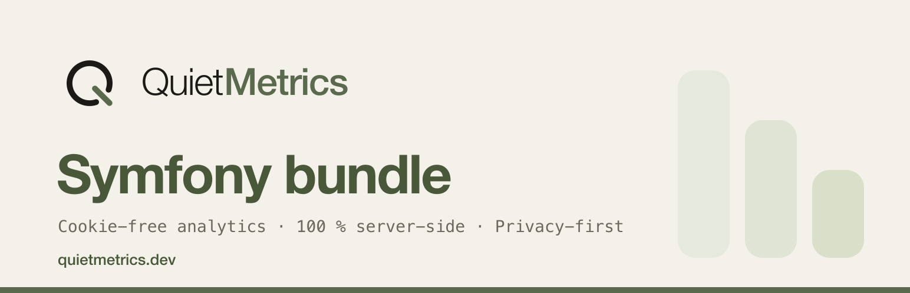

# quiet-metrics/symfony-metrics



> 🇬🇧 [English version](README.md)

Bundle Symfony (6.4 et 7.x) du SDK PHP [Quiet Metrics](https://quietmetrics.dev) : mesure d'audience sans cookies, 100 % côté serveur, imblocable par les adblockers. Les pages vues partent automatiquement en `kernel.terminate`, sans JavaScript et sans jamais ralentir le site.

## Installation

```bash
composer require quiet-metrics/symfony-metrics
```

Avec Symfony Flex, le bundle est enregistré automatiquement (type `symfony-bundle`). Sans Flex, ajoutez-le à `config/bundles.php` :

```php
// config/bundles.php
return [
    // ...
    QuietMetrics\Symfony\QuietMetricsBundle::class => ['all' => true],
];
```

### Avant la publication sur Packagist

Déclarez les deux dépôts GitHub, le bundle dépend du package cœur. `php-metrics` est public ; `symfony-metrics` est encore privé, l'accès n'est requis que pour celui-là :

```json
{
    "repositories": [
        { "type": "vcs", "url": "https://github.com/Quiet-Metrics/php-metrics" },
        { "type": "vcs", "url": "https://github.com/Quiet-Metrics/symfony-metrics" }
    ]
}
```

```bash
composer require quiet-metrics/symfony-metrics:^0.1
```

## Configuration

L'alias de configuration est `quiet_metrics`.

```yaml
# config/packages/quiet_metrics.yaml
quiet_metrics:
    public_key: '%env(QUIET_METRICS_PUBLIC_KEY)%'   # clé publique du site (obligatoire)
    secret_key: '%env(QUIET_METRICS_SECRET_KEY)%'   # indispensable en envoi serveur : signe chaque hit (HMAC)

    # endpoint: 'https://quietmetrics.dev/api/v1/collect'  # défaut : endpoint SaaS Quiet Metrics du SDK cœur
    # trust_proxy_headers: true   # application derrière un reverse proxy (X-Forwarded-For / X-Forwarded-Proto)
    # auto_pageview: false        # désactive la pageview automatique (événements manuels uniquement)
```

```bash
# .env.local
QUIET_METRICS_PUBLIC_KEY=qm_pub_xxx
QUIET_METRICS_SECRET_KEY=qm_sec_xxx
```

> **Pourquoi la clé secrète compte.** Elle active le mode signé, seul cas où
> l'IP et le User-Agent du visiteur transmis par votre serveur font foi. Sans
> elle, chaque hit est attribué à l'IP de votre serveur : tous vos visiteurs
> n'en compteraient qu'un seul.

## Usage

Les pageviews des réponses HTML réussies partent toutes seules : rien à faire.

Pour les événements personnalisés, injectez le client du SDK cœur (`QuietMetrics\Client`, câblé par le bundle) :

```php
use QuietMetrics\Client;
use Symfony\Component\HttpFoundation\Response;

final class CheckoutController
{
    public function __construct(private readonly Client $quietMetrics) {}

    public function confirm(): Response
    {
        $this->quietMetrics->event('achat', ['montant' => 49, 'plan' => 'pro']);
        // ...
    }
}
```

Avec `auto_pageview: false`, vous gardez la main sur les pages vues :

```php
// Contexte (URL, referrer, IP, User-Agent, langue) déduit de la requête
// courante, surchargeable clé par clé :
$this->quietMetrics->pageview();
$this->quietMetrics->pageview(['url' => 'https://monsite.fr/merci']);
```

## Comment ça marche

- L'envoi a lieu sur `kernel.terminate` : la réponse est déjà partie chez le visiteur, aucune latence perçue. Le client du SDK cœur est lui-même non bloquant (socket write-and-forget, repli cURL avec timeout court, échecs silencieux) : l'analytics ne casse jamais le site hôte.
- Le listener ne compte que les vraies pages : requêtes `GET`, réponse 2xx, `Content-Type` HTML, hors requêtes AJAX.
- Le contexte est lu depuis l'objet `Request` (jamais les superglobales) : correct sous RoadRunner et FrankenPHP, dans les tests, et aligné sur les trusted proxies configurés dans l'application hôte.
- Avec `secret_key`, chaque envoi est signé HMAC-SHA256 (en-têtes `X-QM-Timestamp` et `X-QM-Signature`) ; l'IP et le User-Agent du visiteur transmis par le SDK font alors foi côté collecte.

## Licence

MIT. Un produit [La Boîte à Code](https://laboiteacode.fr) pour [Quiet Metrics](https://quietmetrics.dev).
